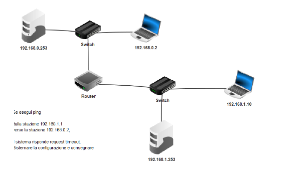

# Filius-Router
# Primo esercizio su Filius 
#### Collegare due reti tramite un router, per  prima cosa colleghiamo due pc ad uno switch che a sua volta colleghiamo ad un router e facciamo lo stesso dall’altro lato cosi’ che abbiamo due reti collegate ad un router,poi inseriamo subnetmask e ip ad ogni pc. Dopo aver fatto tutto questo settiamo tutti i pc in DHCP(il DHCP fornisce un host ip con l’indirizzo ip e altre informazioni di configurazione), poi inseriamo il default gateway che grazie a questo le due reti comunicano.
Il DHCP in poche parole serve per fornire un IP ad ogni dispositivo che si connette alla rete ES (quando con il telefono ci connettiamo alla rete il DHCP ci fornisce un IP).

#### Ogni volta che noi facciamo un ping verso un computer inviamo un ARP(Protocollo ARP)che è tipo una richiesta, dopo aver inviato l’ARP inviamo un pacchetto verso destinazione. 
#### Inizialmente i PC delle due reti non comunicavano con ping perché nella prima rete i PC non avevano configurato il default gateway, e nell’altra rete l’indirizzo ip era sbagliato e non era settato il default gateway, dopo averlo configurato infatti vediamo che il ping arriva a destinazione .

